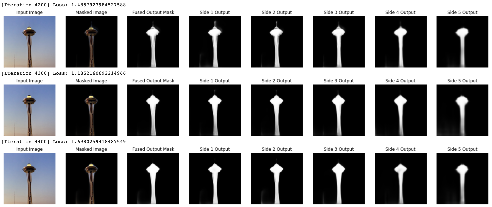

# u2net-tensorflow

A tensorflow implementation of the [U2-Net: Going Deeper with Nested U-Structure for Salient Object Detection](https://arxiv.org/pdf/2005.09007.pdf) using Keras & Functional API

Based on the [PyTorch version](https://github.com/NathanUA/U-2-Net) by NathanUA

### Notebook
If you just want to play with the model, I've setup a [Google Colab Notebook](https://colab.research.google.com/drive/1bGkgDBAmn7FUX_lws3OYF8Klw80ddMN7?usp=sharing) that lets you train the model on DUTS-TR, and it's v fun to watch the model learn to mask a skateboard it's never seen before while it trains. Training takes ~60 minutes to get to decent results. Please let me know if you have any questions.



## Setup 

```
virtualenv venv
source venv/bin/activate
pip install tensorflow matplotlib opencv-python wget
```

The `U2NET` class can be used to instatiate a modular instance of the U2-Net network
```python
from models.u2net import U2NET

u2net = U2NET()
out = u2net(inp)
```

## Training

**Optional:** Download the [DUTS-TR](http://saliencydetection.net/duts/#org3aad434) dataset and unzip into the `data` directory to load the training set. If [train.py](train.py) does not detect the dataset is present when run, it will automatically try to download and setup the dataset before initiating training.

```
wget http://saliencydetection.net/duts/download/DUTS-TR.zip
unzip DUTS-TR.zip -d data
```

Then to train, simply run:

```
python train.py
```

Weights are automatically saved every `save_interval` iterations to `weights/u2net.h5`. These can be overwritten by passing the appropriate arguments. See `python train.py -h` for args.

## Citation
```
@InProceedings{Qin_2020_PR,
title = {U2-Net: Going Deeper with Nested U-Structure for Salient Object Detection},
author = {Qin, Xuebin and Zhang, Zichen and Huang, Chenyang and Dehghan, Masood and Zaiane, Osmar and Jagersand, Martin},
journal = {Pattern Recognition},
volume = {106},
pages = {107404},
year = {2020}
}
```